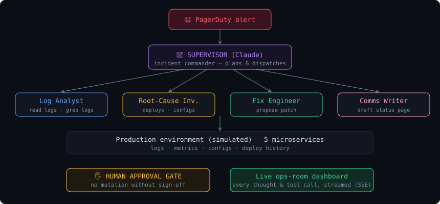

# 🚨 WarRoom — an AI-native incident response team

**Track 3 (AI-native Enterprise, Open) · The Great Agent Hackathon · TGPF 2026**

When production breaks at 3 AM, nobody wants to be the only human awake grepping logs. WarRoom is an autonomous multi-agent incident response team built on Claude: a **Supervisor** (incident commander) dispatches **specialist agents** — Log Analyst, Root-Cause Investigator, Fix Engineer, Comms Writer — that investigate a live system with real tools, converge on the root cause, propose a fix behind a **human approval gate**, and draft the customer status page. Every thought, tool call, and observation streams to a live ops-room dashboard.



## What the demo shows

A simulated e-commerce company ("Kartify") is mid-outage: a bad deploy set `DB_POOL_SIZE` from 50 → 5 on the payments service, exhausting the connection pool and cascading timeouts into orders and the API gateway. You hit **Trigger incident** and watch:

1. **Supervisor** takes command of the PagerDuty alert and dispatches the Log Analyst.
2. **Log Analyst** greps logs across services, separates the origin (payments) from the cascade (orders, gateway).
3. **Root-Cause Investigator** correlates deploy history with the failure timeline and names the exact config change.
4. **Fix Engineer** produces the minimal diff and submits it — **you** click *Approve & apply*. Nothing touches prod without a human.
5. Telemetry recovers live on the service health map.
6. **Comms Writer** drafts the public status page; the Supervisor closes with a postmortem.

None of the investigation is scripted — the agents genuinely reason over the environment through tools.

## Run it

```bash
npm install
node server.js
# open http://localhost:4141 and click "Trigger incident"
```

LLM backend (auto-detected):
- `ANTHROPIC_API_KEY` in `.env` or the environment → official Anthropic SDK, `claude-opus-5` (override with `WARROOM_MODEL`).
- No/invalid key → falls back to the local `claude` CLI in headless mode (any Claude Code login works).

**Replay mode:** every live run is recorded to `recordings/last-run.json`. The **Replay** button re-streams the last real run with natural pacing (the approval gate stays interactive) — insurance for flaky venue Wi-Fi during stage demos.

## Architecture

```
PagerDuty alert ──► SUPERVISOR (incident commander, Claude)
                        │ dispatch(agent, objective)
        ┌───────────────┼────────────────┬──────────────┐
   Log Analyst    Root-Cause Inv.   Fix Engineer   Comms Writer
        │               │                │              │
        └── observe→think→act tool loops over the environment ──┘
   tools: list_services · read_logs · grep_logs · get_config
          get_recent_deploys · propose_patch → 🖐 HUMAN GATE → apply
          draft_status_page
                        │
                  SSE event stream ──► live ops-room dashboard
```

- `agents.js` — supervisor + specialist orchestration (observe→think→act JSON protocol)
- `sim.js` — the simulated production environment and the tool implementations
- `llm.js` — pluggable Claude backend (SDK / CLI)
- `server.js` — zero-framework Node server: SSE streaming, approval gate, record/replay
- `public/` — the dashboard (vanilla JS, no build step)

Zero runtime dependencies beyond `@anthropic-ai/sdk`.

## Why this matters

Incident response is the sharpest version of the enterprise agent problem: high stakes, messy evidence, time pressure, and a hard requirement that humans stay in control. WarRoom's answer — specialist agents with narrow tool scopes, a commander that owns the plan, full observability of agent reasoning, and approval gates on anything mutating — is a blueprint for AI-native enterprise operations far beyond outages: security triage, data-quality firefights, release verification, fraud response.

## Team

**Lakshmi Nivas Reddy Rachapalli** (solo) — agentic systems builder: voice agents (Bolna platform), computer-vision pipelines (SAE AeroTHON), multiple agent hackathon builds. lakshminivas0006@gmail.com
